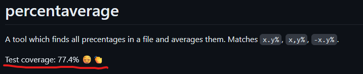

# Simple Go Pipeline
The simple go pipeline provides modular validation and test-coverage.
It has minimal amounts of dependencies, is fully customizable and gives test coverage in `README.md` without any third party websites.

Use it, or fork it and hack it! 

Examples:
  - [Pipeline](https://github.com/baalimago/percentaverage/actions/runs/7308650137)
  - Test coverage printout:



By default, it:
  - Builds the application
  - Checks that the code is adheres to [staticcheck](https://staticcheck.dev/) linting
  - Checks that the code is formated with [gofumpt](https://github.com/mvdan/gofumpt)
  - Tests with `-race` flag

On exit code or similar failures, the pipeline will fail.


## Usage
Create a file `<github-repo>/.github/workflows/go.yml` with this in it: 

```yaml
name: Simple Go Pipeline

on:
  push:
    branches: [ "main" ]
  pull_request:
    branches: [ "main" ]

jobs:
  call-workflow:
    uses: baalimago/simple-go-pipeline/.github/workflows/go.yml@v0.1.1
    with:
        test-readme-coverage: false
```

Done!

[See here](https://github.com/baalimago/simple-go-pipeline/blob/main/.github/workflows/go.yml) for the input variables you should change to enable/disable the different aspects of the validation.
For example, `jobs.call-workflow.with.staticcheck: false` (in proper yml indention), would disable the staticcheck.

## Test coverage readme
In order to get test coverage updated automatically updated into your readme, do like this:
1. __Carefully review your Gitlab Actions workflows, including this repo..!__
1. Go to `https://github.com/<your-account>/<your-project>/settings/actions`
1. Set `Workflow Permissions` to `Read and write perimssions` 
1. Hit save
1. Somewhere within your `README.md`, add the line `Test coverage:`
1. Remove `test-readme-coverage: false` from your `go.yml` github actions workflow specification (it's true by default)
