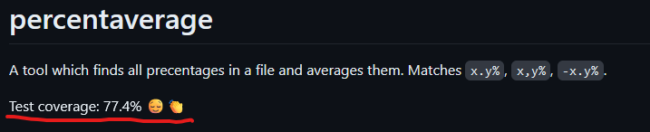

# Simple Go Pipeline
The simple go pipeline provides modular validation and test-coverage.
It has minimal amounts of dependencies, is fully customizable and gives test coverage in `README.md` without any third party websites.

Use it, or fork it and hack it! 

Examples:
  - [Pipeline](https://github.com/baalimago/percentaverage/actions/runs/7308650137)
  - Test coverage printout:



By default, it:
  - Builds the application
  - Checks that the code is adheres to [staticcheck](https://staticcheck.dev/) linting
  - Checks that the code is formated with [gofumpt](https://github.com/mvdan/gofumpt)
  - Tests with `-race` flag

On exit code or similar failures, the pipeline will fail.


## Usage
Create a file `<github-repo>/.github/workflows/go.yml` with this in it: 

```yaml
name: Simple Go Pipeline

on:
  push:
    branches: [ "main" ]
  pull_request:
    branches: [ "main" ]

jobs:
  call-workflow:
    uses: baalimago/simple-go-pipeline/.github/workflows/go.yml@v0.2.8
    with:
        test-readme-coverage: false
```

Done!

[See here](https://github.com/baalimago/simple-go-pipeline/blob/main/.github/workflows/go.yml) for the input variables you should change to enable/disable the different aspects of the validation.
For example, `jobs.call-workflow.with.staticcheck: false` (in proper yml indention), would disable the staticcheck.

## Release pipeline

[`.github/workflows/release.yml`](.github/workflows/release.yml) is a reusable
workflow that builds release binaries for a version tag, creates one release,
and uploads every asset with a `SHA256SUMS` checksum file. It supports two
caller shapes:

The tag must be a semver version (`v<major>.<minor>.<patch>`, optionally with
prerelease or build metadata). A tag with a prerelease identifier such as
`v1.2.3-rc1` creates a GitHub **prerelease**; a stable tag such as `v1.2.3`
creates a normal release. Any other tag fails the workflow before a build
starts, so no release is ever created from a non-semver tag.

If the commit the tag points to has `no-release` (case-insensitive) in its
commit message, the workflow skips every build and creates no release. This is
useful for tags that exist only as library or test versions, for example when
trying `go install` against a tagged commit without publishing a release.

Release notes for a stable release cover changes since the previous stable
release. Release notes for a prerelease use GitHub's default range.

- **Pure-Go callers** omit the native inputs. The workflow cross-compiles the
  default matrix (darwin and linux on amd64, arm64, and 386, excluding
  darwin-386) on ubuntu-latest with `go build`, then creates one release.
- **Native callers** (CGo, vendored C libraries) pass `targets` and the
  per-target commands. Each target runs on its own runner because
  `GOOS`/`GOARCH` cross-compilation cannot build CGo.

```yaml
name: Release

on:
  push:
    tags: ["v[0-9]+.[0-9]+.[0-9]+*"]

permissions:
  contents: write

jobs:
  call-workflow:
    uses: baalimago/simple-go-pipeline/.github/workflows/release.yml@v0.4.0
    with:
      project-name: my-tool
      branch: main
```

### Inputs

| Input | Default | Effect |
| ----- | ------- | ------ |
| `go-version` | `1.25` | Go toolchain version for every target. |
| `project-name` | required | Binary root name; artifacts are `<project-name>-v<version>-<os>-<arch>[.exe]`. |
| `branch` | required | Branch to which the release should target. |
| `version-var` | empty | Go linker variable (`importpath.name`) receiving the release version; empty disables the `-X` flag in the default build. |
| `targets` | default pure-Go matrix | JSON array of `{os, arch, runner}` triples; each entry runs on its own runner. Must contain at least one entry. |
| `native-setup-command` | empty | Shell command preparing one target; runs before the build. |
| `native-build-command` | empty | Shell command building the binary into `$TARGET_BINARY`; overrides the default `GOOS`/`GOARCH` build. |
| `dependency-check-command` | empty | Shell command inspecting `$TARGET_BINARY`; fails on non-baseline dynamic dependencies. |
| `smoke-command` | empty | Shell command starting `$TARGET_BINARY`; when empty, native callers (with `native-build-command` set) run the default `--version` smoke and pure-Go callers run no smoke. |
| `checksum-command` | empty | Shell command emitting the `SHA256SUMS` file from the given asset paths (sorted, two spaces, lowercase); default: `sha256sum | grep -v SHA256SUMS | sort -k2`. |
| `notice-file` | empty | Path in the caller repository whose content is attached to the release as a license notice; empty disables. |

Every target step receives `TARGET_OS`, `TARGET_ARCH`, `TARGET_BINARY`, and
`RELEASE_VERSION` (the tag name verbatim, for example `v1.2.3` or
`v1.2.3-rc1`) as environment variables, so the caller's setup, build,
dependency, and smoke commands are target-aware. The version injected through
`version-var` is the tag name verbatim; callers strip the `v` when it belongs
in the linker variable.

One assembly job creates one release after every target succeeded, so no
matrix job can race to create a release or attach assets to an unrelated
latest release. The checksum file covers the exact uploaded bytes: it is
created after the notice copy and before `gh release create` uploads `dist/*`.

## Test coverage readme
In order to get test coverage updated automatically updated into your readme, do like this:
1. __Carefully review your Gitlab Actions workflows, including this repo..!__
1. Go to `https://github.com/<your-account>/<your-project>/settings/actions`
1. Set `Workflow Permissions` to `Read and write perimssions` 
1. Hit save
1. Somewhere within your `README.md`, add the line `Test coverage:`
1. Remove `test-readme-coverage: false` from your `go.yml` github actions workflow specification (it's true by default)
